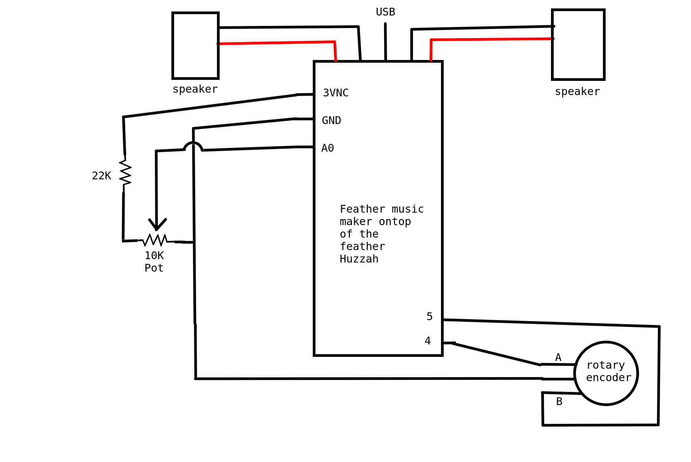

# The All-in-One Streaming Radio

Do you have some less tech-savvy family, who wishes they could listen to the music they *used* to listen to? A friend or family member who would love listening to [99 percent invisible](https://99percentinvisible.org/), [radiolab](https://www.wnycstudios.org/podcasts/radiolab), or other cool podcast, but would throw the computer in a river before they figured out how to listen to one? Why not make a sytem you can put into an old-timey radio case, with simple controls, that would let them do just that? ...Listen to podcasts or their own music, I mean, not throw computers in the river. That's what this project is all about!

# Features

## Simple interface
The plan is to keep the interface simple and familiar. One knob for volume, one for switching between different "radio station" options. There may be a future plan to add a skip/back button setup, but for now, I'm keeping it simple. 

This is both for ease-of-development and to help non-tech-savvy people. 

## The "radio station" options
A knob controls different "radio stations", but what are they and why are they in quotes? Each "radio station" is actually a stream from someplace. Right now, I'm building out functionality so you can easily add your own internet streaming radio stations, music that's stored on a SD card, and eventually, the ability to have individual podcasts, too!

### Internet Radio
Currently only tested with [soma.fm](soma.fm) radio, you can pass in the URL from a direct stream, such as [http://ice6.somafm.com/groovesalad-128-mp3](http://ice6.somafm.com/groovesalad-128-mp3) and it will automatically stream. 

### Music on a microSD card
It doesn't just have to be internet radio, it can also be saved music you already own. Currently only tested with MP3, you can put music in folders on a microSD card, put it in the hardware, and set the code to use each folder you added as its own radio station!

**NOTE** Because I'm using Arduino and it's a FAT filesystem, the directories must have short names, and the files must have short names (such as track001.mp3). I eventually plan on adding a tool to help format the SD card in the correct manner so you don't have to do too much messing around with it yourself.

### Podcasts - (Future)
This is future functionality right now. The eventual plan is to let you set an RSS feed to a podcast, and it will automatically pull in the podcast episodes, in order. Each podcast will be its own "station" on the radio. 

## The Hardware
I'm using an [adafruit Huzzah with ESP8266](https://www.adafruit.com/product/2821) as my main brains. It has built-in wifi support and seems smart enough for my needs. To play the music, I'm using the [adafruit music maker featherwing](https://www.adafruit.com/product/3436) which uses the VS1053B codec chip, allowing it to support Ogg Vorbis, MP3/MP2/MP1, MP4, AAC, WMA, FLAC, WAV/PCM, and MIDI formats, plus it has a built in microSD card slot, which I'm using for that radio station option above. The sound comes from two [3W 4 Ohm mono speakers](https://www.adafruit.com/product/4445).

### temporary hardware
Right now I'm using a [10K linear pot](https://www.adafruit.com/product/562) from adafruit with a 22K resistor for the volume control, and a single [momentary switch button](https://www.adafruit.com/product/1119) for switching between stations. Eventually this will be replaced with rotary encoders for both. 

## Config file - (Future)
Eventually, I plan on having a simple configuration file on the microSD card that the feather will read on start up, which is where you'll put the list of "radio stations" and where to find them. 

# How to get started

Current hardware wiring schematic is in the docs folder, I wired it up using a breadboard.

You can update the `VOLUME_KNOB` definition or the `CYCLE_THRU_STREAMS_BUTTON` definition in the code if you want to connect either to a different pin on the feather, but this setup will work with the code as is. 

## Adding your own streams
Once connected, update the code in `internet_streaming.cpp` file to add your streams. First section you modify starts with `/*-----UPDATE STREAM LIST AND LENGTH HERE----*/`. Here you add new internet streaming radio URLs. You can see the format from the example ones, pass in host and path separately. Make sure to update the `StreamLength` to the new number of total streams.

If you're adding folders from your microSD card, add `SDRadioStream`s with the given directory. 

>**NOTE** The MP3 files you add *MUST* have short names that follow the 8.3 format! AKA give them all names with 8 or fewer characters, such as "TRACK001.mp3". Otherwise the code will not see the files and you'll be frustated.

After you do that, and update `StreamLength`, go to the section that starts with `/* ADD NEW STREAMS HERE */`. There, add more lines to include the new streams you added. The second parameter is the order of the streams when you flip through the stations, so be sure to put them in the order you want. 

## Setting up WIFI
You add your wifi by going to the `internetRadioStream.h` file and adding your SSID and password in the private variables named `ssid` and `password`

## Copying Code to the Feather

Now that the code is sorted, you need to get the code onto the feather. For this, you must have it setup to support Arduino. Adafruit has a [tutorial](https://learn.adafruit.com/adafruit-feather-huzzah-esp8266/using-arduino-ide) that explains how to do that. Make sure to install the ESP8266 library and get blinky running on it.

After that, add the Adafruit_VS1053 library, SD library, and ESP8266WiFi to the Arduino IDE. 

I don't use the Arduino IDE (because I deeply dislike it). Instead I use Visual Studio Code. So I use make files instead of the default Arduino IDE verify/upload buttons. I installed the `makeESPArduino` makefile from here: [https://github.com/plerup/makeEspArduino](https://github.com/plerup/makeEspArduino) by following the simple install:

    cd ~
    git clone https://github.com/plerup/makeEspArduino.git

Once that's done, go into the new `makeESPArduino` folder, and run `make -f makeEspArduino.mk DEMO=1 flash` to test the make file is setup correctly. The demo it defaulted to was a wifi scanning script for me, and you can look at it on serial monitor in the Arduino IDE or using the `screen` command: `screen /dev/ttyUSB0 115200` (`ctrl+a` followed by `k` will kill a screen session)

*Finally* you can go to the root of this git repo, and simply type `make run`, which will build the code, flash it onto the Huzzah, and start a miniterm serial monitor (exit that with `ctrl+]`)

Yes, it's pretty complicated, I'll be working on improving the process.